# Data Engineering Pipelines with Snowpark Python
This repository contains the code for the *Data Engineering Pipelines with Snowpark Python* Snowflake Quickstart.

### ➡️ For overview, prerequisites, and to learn more, complete this end-to-end tutorial [Data Engineering Pipelines with Snowpark Python](https://quickstarts.snowflake.com/guide/data_engineering_pipelines_with_snowpark_python/index.html?index=..%2F..index#0) on quickstarts.snowflake.com.

___
Here is an overview of what we'll build in this lab:

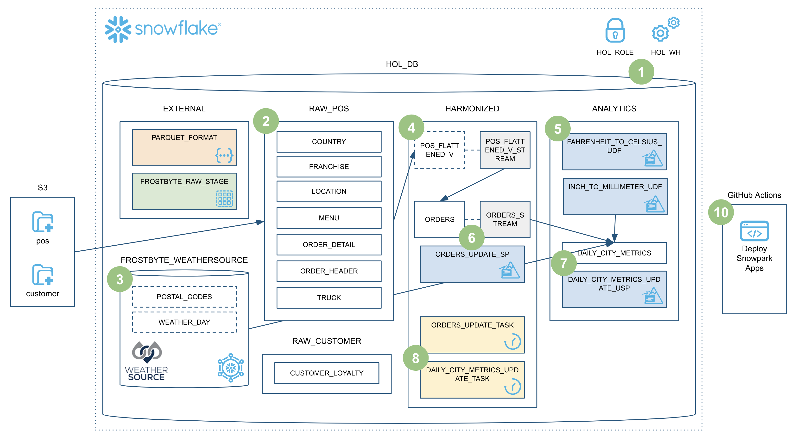

## step01 Setup Snowflake

run steps/01_setup_snowflake.sql
___
Here is picture of excution

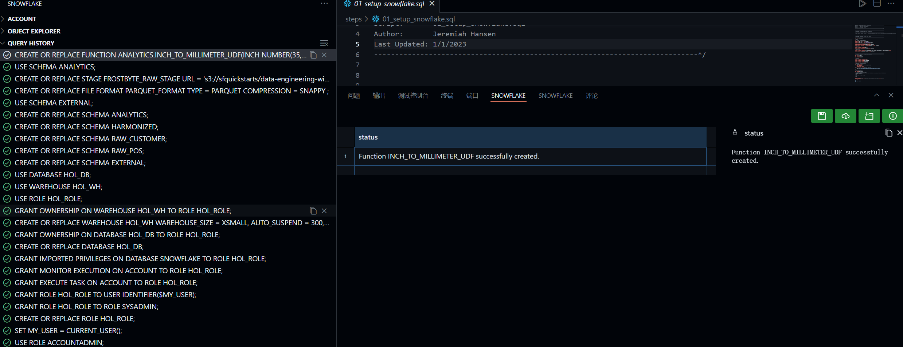

## step02 Load Raw

see result in lab1.log:
#1
- Loading country
- Loading franchise
- Loading location
- Loading menu
- Loading truck
- Loading order_header
  - Loading year 2019
  - Loading year 2020
  - Loading year 2021
- Loading order_detail
  - Loading year 2019
  - Loading year 2020
  - Loading year 2021
- Loading customer_loyalty


## step03 Load Weather

Here is picture of excution

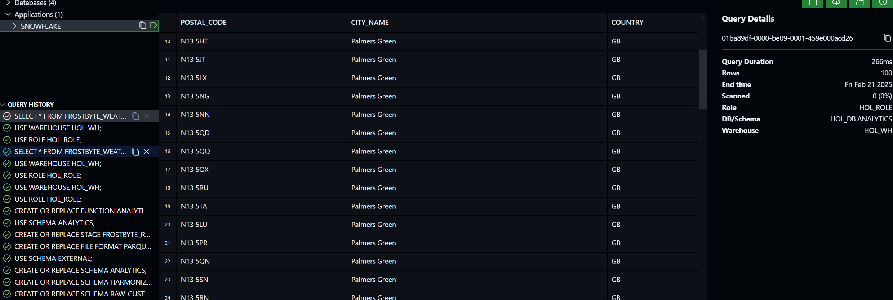

Here is picture of snowflake

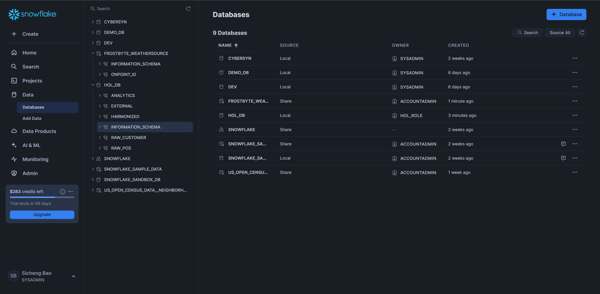

## step04 Create POS View

No logs

## step05 Fahrenheit to Celsius UDF

see result in lab1.log:

```text
#5
1.6666666666666667

#build
Resolving dependencies from requirements.txt
  No external dependencies.
Preparing artifacts for source code
  Creating: fahrenheit_to_celsius_udf.zip
Build done.

#deploy
Performing initial validation
Checking remote state
Preparing required stages and artifacts
  Creating (if not exists) stage: analytics.deployment
  Uploading fahrenheit_to_celsius_udf.zip to @HOL_DB.analytics.deployment/hol/
Creating Snowpark entities
  Creating function hol_db.analytics.fahrenheit_to_celsius_udf
+-------------------------------------------------------------------------------+
| object                                                   | type     | status  |
|----------------------------------------------------------+----------+---------|
| hol_db.analytics.fahrenheit_to_celsius_udf(temp_f float) | function | created |
+-------------------------------------------------------------------------------+
Successfully processed ORDERS
```

## step06 Orders Update Sproc
see result in lab1.log:
```text
#6
#build
Resolving dependencies from requirements.txt
  No external dependencies.
Preparing artifacts for source code
  Creating: orders_update_sp.zip
Build done.

#deploy
Performing initial validation
Checking remote state
Preparing required stages and artifacts
  Creating (if not exists) stage: harmonized.deployment
  Uploading orders_update_sp.zip to @HOL_DB.harmonized.deployment/hol/
Creating Snowpark entities
  Creating procedure hol_db.harmonized.orders_update_sp
+------------------------------------------------------------+
| object                               | type      | status  |
|--------------------------------------+-----------+---------|
| hol_db.harmonized.orders_update_sp() | procedure | created |
+------------------------------------------------------------+
```
## step07 Daily City Metrics Update Sproc

see result in lab1.log:

```text
#7
340338495 records in stream
--------------
|"DATE"      |
--------------
|2021-11-28  |
|2021-07-24  |
|2020-12-28  |
|2021-09-14  |
|2021-10-27  |
--------------
Successfully processed DAILY_CITY_METRICS

#build
Resolving dependencies from requirements.txt
  No external dependencies.
Preparing artifacts for source code
  Creating: daily_city_metrics_update_sp.zip
Build done.

#deploy
Performing initial validation
Checking remote state
Preparing required stages and artifacts
  Creating (if not exists) stage: analytics.deployment
  Uploading daily_city_metrics_update_sp.zip to @HOL_DB.analytics.deployment/hol/
Creating Snowpark entities
  Creating procedure hol_db.analytics.daily_city_metrics_update_sp
+-----------------------------------------------------------------------+
| object                                          | type      | status  |
|-------------------------------------------------+-----------+---------|
| hol_db.analytics.daily_city_metrics_update_sp() | procedure | created |
+-----------------------------------------------------------------------+
Requirement already satisfied: snowflake-snowpark-python in /opt/conda/envs/snowflake-demo/lib/python3.10/site-packages (from -r requirements.txt (line 1)) (1.25.0)
Collecting scipy (from -r requirements.txt (line 2))
  Downloading scipy-1.15.2-cp310-cp310-manylinux_2_17_x86_64.manylinux2014_x86_64.whl.metadata (61 kB)
Requirement already satisfied: setuptools>=40.6.0 in /opt/conda/envs/snowflake-demo/lib/python3.10/site-packages (from snowflake-snowpark-python->-r requirements.txt (line 1)) (75.8.0)
Requirement already satisfied: wheel in /opt/conda/envs/snowflake-demo/lib/python3.10/site-packages (from snowflake-snowpark-python->-r requirements.txt (line 1)) (0.44.0)
Requirement already satisfied: snowflake-connector-python<4.0.0,>=3.12.0 in /opt/conda/envs/snowflake-demo/lib/python3.10/site-packages (from snowflake-snowpark-python->-r requirements.txt (line 1)) (3.13.2)
Requirement already satisfied: typing-extensions<5.0.0,>=4.1.0 in /opt/conda/envs/snowflake-demo/lib/python3.10/site-packages (from snowflake-snowpark-python->-r requirements.txt (line 1)) (4.12.2)
Requirement already satisfied: pyyaml in /opt/conda/envs/snowflake-demo/lib/python3.10/site-packages (from snowflake-snowpark-python->-r requirements.txt (line 1)) (6.0.2)
Requirement already satisfied: protobuf<6,>=3.20 in /opt/conda/envs/snowflake-demo/lib/python3.10/site-packages (from snowflake-snowpark-python->-r requirements.txt (line 1)) (4.25.3)
Requirement already satisfied: tzlocal in /opt/conda/envs/snowflake-demo/lib/python3.10/site-packages (from snowflake-snowpark-python->-r requirements.txt (line 1)) (5.2)
Requirement already satisfied: cloudpickle!=2.1.0,!=2.2.0,<=2.2.1,>=1.6.0 in /opt/conda/envs/snowflake-demo/lib/python3.10/site-packages (from snowflake-snowpark-python->-r requirements.txt (line 1)) (2.2.1)
Collecting numpy<2.5,>=1.23.5 (from scipy->-r requirements.txt (line 2))
  Downloading numpy-2.2.3-cp310-cp310-manylinux_2_17_x86_64.manylinux2014_x86_64.whl.metadata (62 kB)
Requirement already satisfied: asn1crypto<2.0.0,>0.24.0 in /opt/conda/envs/snowflake-demo/lib/python3.10/site-packages (from snowflake-connector-python<4.0.0,>=3.12.0->snowflake-snowpark-python->-r requirements.txt (line 1)) (1.5.1)
Requirement already satisfied: cffi<2.0.0,>=1.9 in /opt/conda/envs/snowflake-demo/lib/python3.10/site-packages (from snowflake-connector-python<4.0.0,>=3.12.0->snowflake-snowpark-python->-r requirements.txt (line 1)) (1.17.1)
Requirement already satisfied: cryptography>=3.1.0 in /opt/conda/envs/snowflake-demo/lib/python3.10/site-packages (from snowflake-connector-python<4.0.0,>=3.12.0->snowflake-snowpark-python->-r requirements.txt (line 1)) (41.0.3)
Requirement already satisfied: pyOpenSSL<25.0.0,>=22.0.0 in /opt/conda/envs/snowflake-demo/lib/python3.10/site-packages (from snowflake-connector-python<4.0.0,>=3.12.0->snowflake-snowpark-python->-r requirements.txt (line 1)) (23.2.0)
Requirement already satisfied: pyjwt<3.0.0 in /opt/conda/envs/snowflake-demo/lib/python3.10/site-packages (from snowflake-connector-python<4.0.0,>=3.12.0->snowflake-snowpark-python->-r requirements.txt (line 1)) (2.10.1)
Requirement already satisfied: pytz in /opt/conda/envs/snowflake-demo/lib/python3.10/site-packages (from snowflake-connector-python<4.0.0,>=3.12.0->snowflake-snowpark-python->-r requirements.txt (line 1)) (2024.1)
Requirement already satisfied: requests<3.0.0 in /opt/conda/envs/snowflake-demo/lib/python3.10/site-packages (from snowflake-connector-python<4.0.0,>=3.12.0->snowflake-snowpark-python->-r requirements.txt (line 1)) (2.32.3)
Requirement already satisfied: packaging in /opt/conda/envs/snowflake-demo/lib/python3.10/site-packages (from snowflake-connector-python<4.0.0,>=3.12.0->snowflake-snowpark-python->-r requirements.txt (line 1)) (24.2)
Requirement already satisfied: charset_normalizer<4,>=2 in /opt/conda/envs/snowflake-demo/lib/python3.10/site-packages (from snowflake-connector-python<4.0.0,>=3.12.0->snowflake-snowpark-python->-r requirements.txt (line 1)) (3.3.2)
Requirement already satisfied: idna<4,>=2.5 in /opt/conda/envs/snowflake-demo/lib/python3.10/site-packages (from snowflake-connector-python<4.0.0,>=3.12.0->snowflake-snowpark-python->-r requirements.txt (line 1)) (3.7)
Requirement already satisfied: certifi>=2017.4.17 in /opt/conda/envs/snowflake-demo/lib/python3.10/site-packages (from snowflake-connector-python<4.0.0,>=3.12.0->snowflake-snowpark-python->-r requirements.txt (line 1)) (2024.12.14)
Requirement already satisfied: filelock<4,>=3.5 in /opt/conda/envs/snowflake-demo/lib/python3.10/site-packages (from snowflake-connector-python<4.0.0,>=3.12.0->snowflake-snowpark-python->-r requirements.txt (line 1)) (3.13.1)
Requirement already satisfied: sortedcontainers>=2.4.0 in /opt/conda/envs/snowflake-demo/lib/python3.10/site-packages (from snowflake-connector-python<4.0.0,>=3.12.0->snowflake-snowpark-python->-r requirements.txt (line 1)) (2.4.0)
Requirement already satisfied: platformdirs<5.0.0,>=2.6.0 in /opt/conda/envs/snowflake-demo/lib/python3.10/site-packages (from snowflake-connector-python<4.0.0,>=3.12.0->snowflake-snowpark-python->-r requirements.txt (line 1)) (3.10.0)
Requirement already satisfied: tomlkit in /opt/conda/envs/snowflake-demo/lib/python3.10/site-packages (from snowflake-connector-python<4.0.0,>=3.12.0->snowflake-snowpark-python->-r requirements.txt (line 1)) (0.13.2)
Requirement already satisfied: pycparser in /opt/conda/envs/snowflake-demo/lib/python3.10/site-packages (from cffi<2.0.0,>=1.9->snowflake-connector-python<4.0.0,>=3.12.0->snowflake-snowpark-python->-r requirements.txt (line 1)) (2.21)
Requirement already satisfied: urllib3<3,>=1.21.1 in /opt/conda/envs/snowflake-demo/lib/python3.10/site-packages (from requests<3.0.0->snowflake-connector-python<4.0.0,>=3.12.0->snowflake-snowpark-python->-r requirements.txt (line 1)) (2.3.0)
Downloading scipy-1.15.2-cp310-cp310-manylinux_2_17_x86_64.manylinux2014_x86_64.whl (37.6 MB)
   ━━━━━━━━━━━━━━━━━━━━━━━━━━━━━━━━━━━━━━━━ 37.6/37.6 MB 54.9 MB/s eta 0:00:00
Downloading numpy-2.2.3-cp310-cp310-manylinux_2_17_x86_64.manylinux2014_x86_64.whl (16.4 MB)
   ━━━━━━━━━━━━━━━━━━━━━━━━━━━━━━━━━━━━━━━━ 16.4/16.4 MB 53.7 MB/s eta 0:00:00
```

## step08 Orchestrate Jobs

Here is picture of excution:

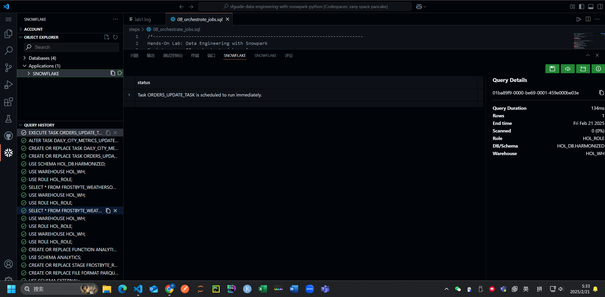

Here is picture of query:

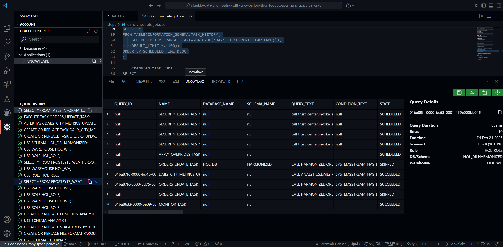

Here is picture of the second task:

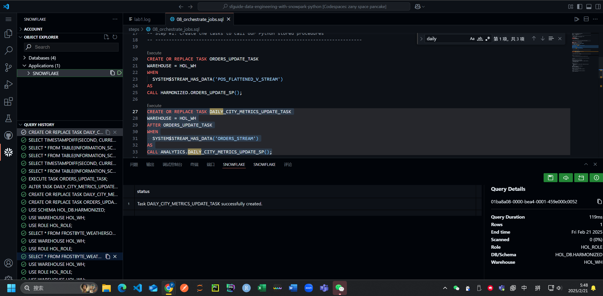

Here is picture of getting a list of tasks:

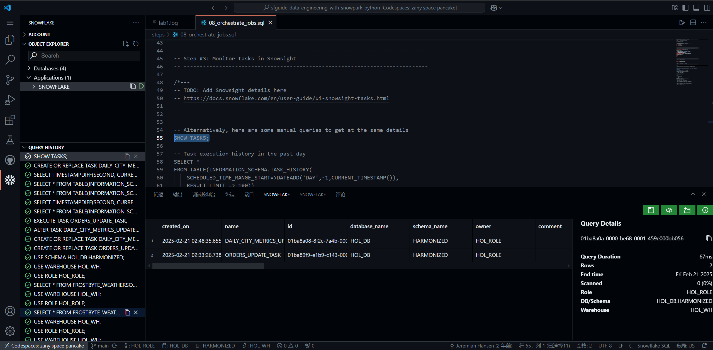

Here is picture of Task execution history in the past day:

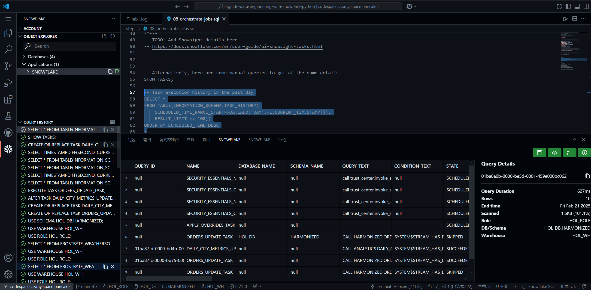

Here is picture of Scheduled task runs:

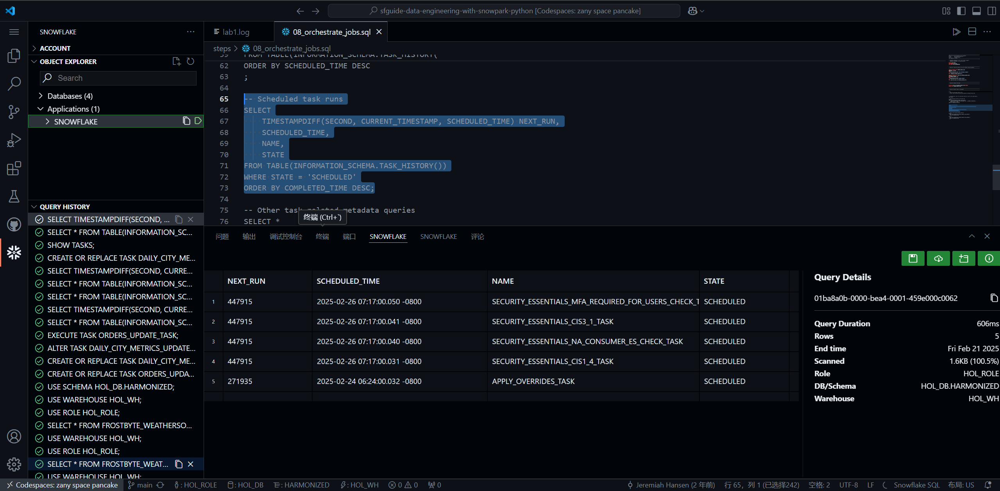

## step09 Process Incrementally

Here is picture of excution:

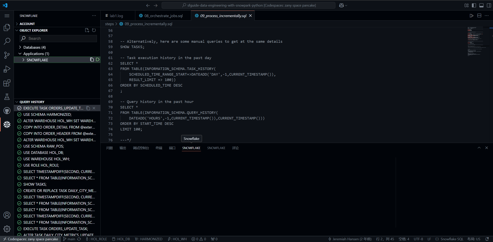

Here is picture of Viewing the Task History:

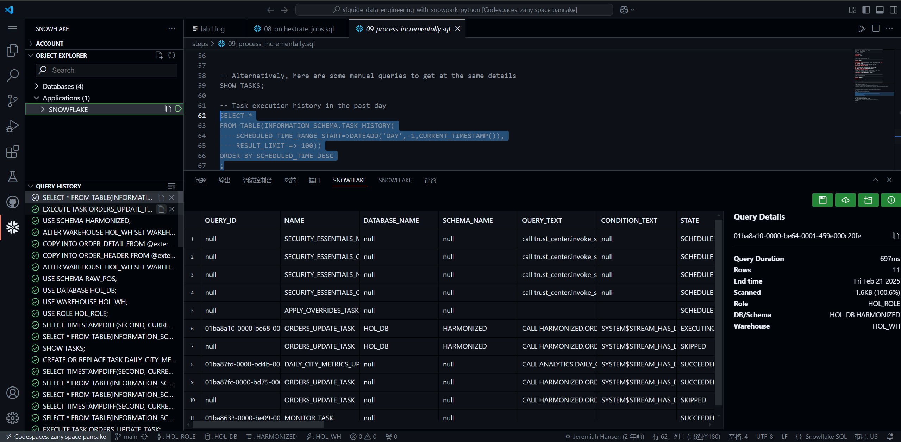

## step10 Deploy Via CI/CD

see results in lab1.log:

```text
Installing collected packages: numpy, scipy
Successfully installed numpy-2.2.3 scipy-1.15.2

1.6666666666666856
```

Here is picture of Github Secrets:

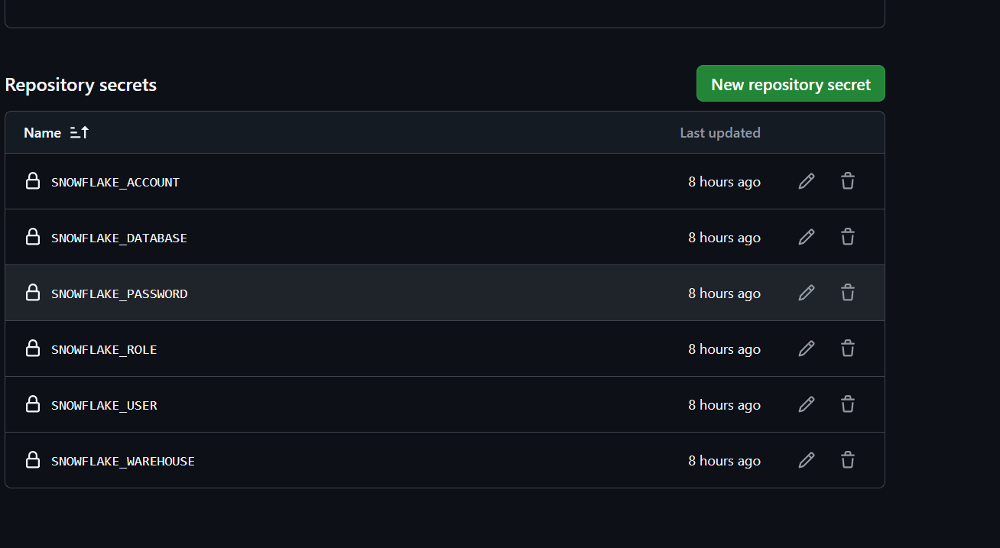

Here is picture of Github Action:

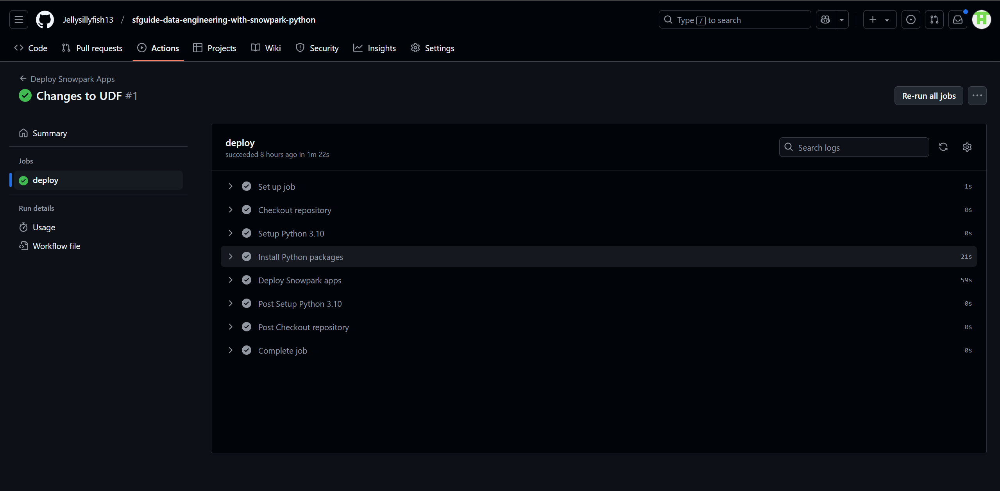

## step11 Teardown

Here is picture of excution:

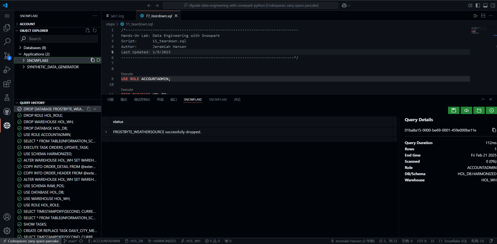


