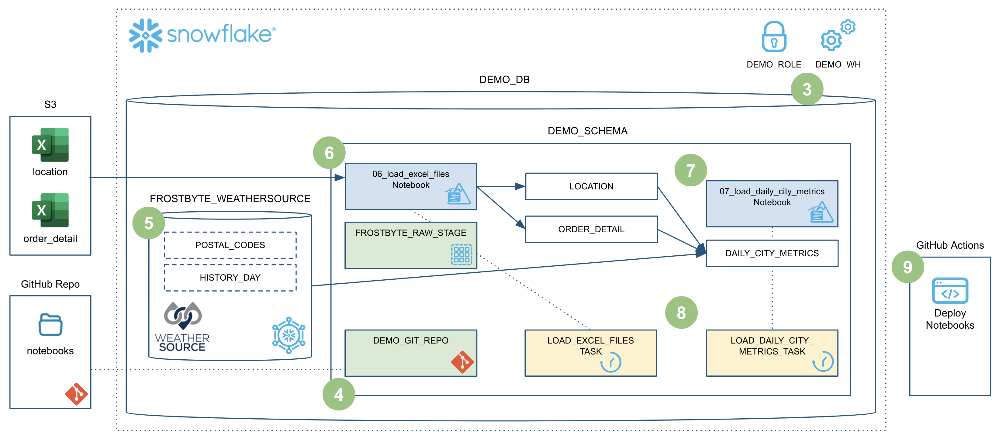
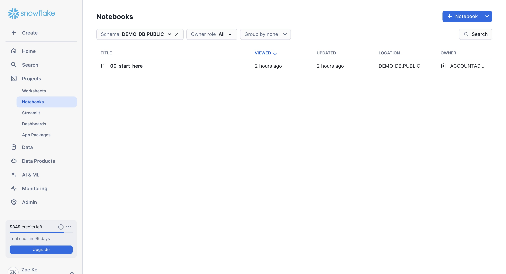
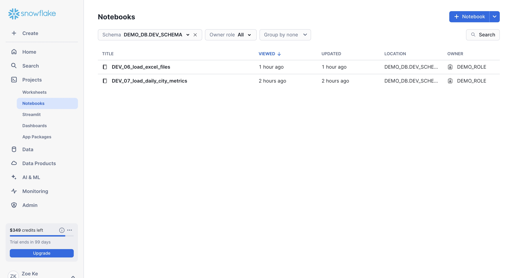
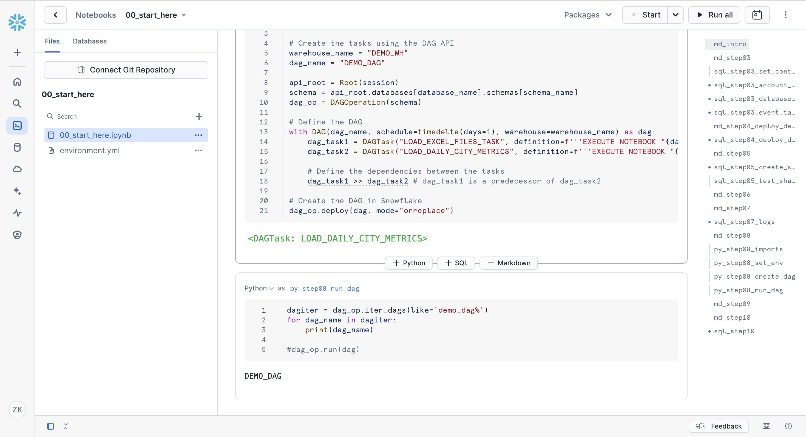
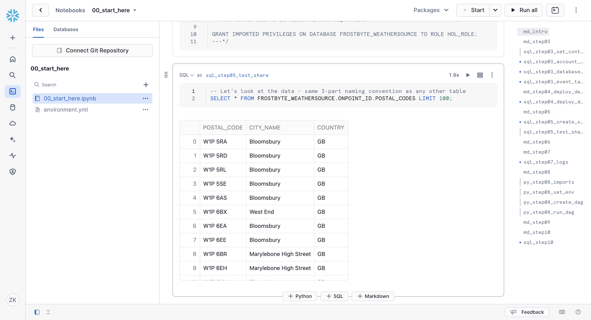
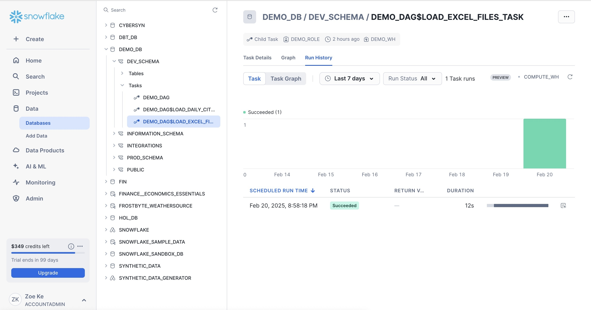
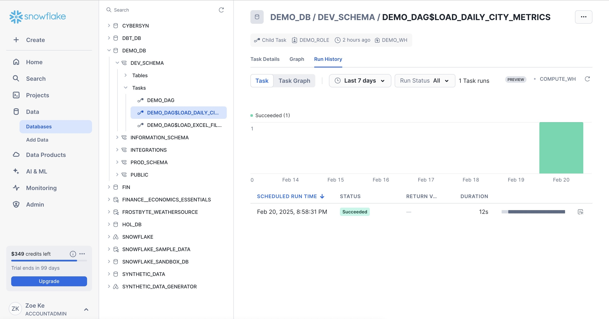
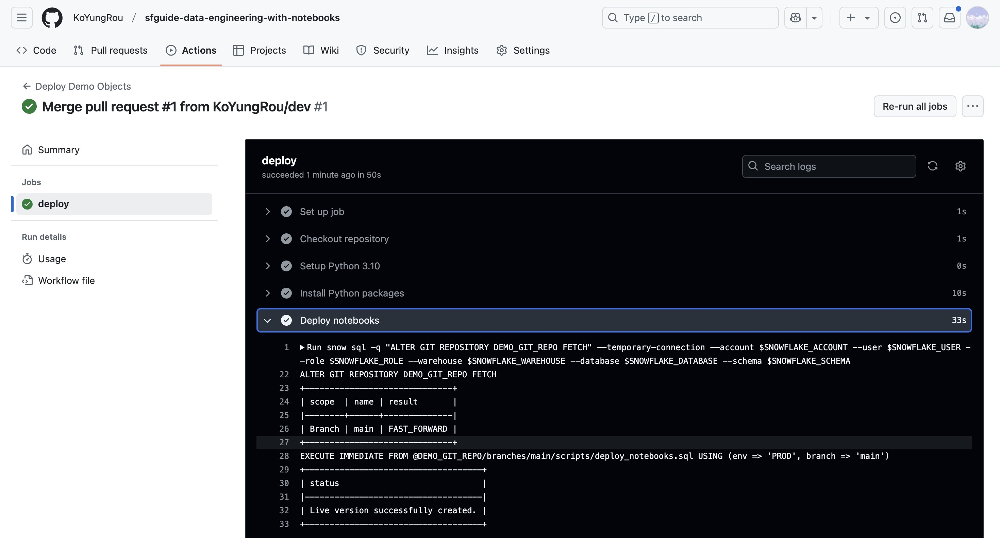
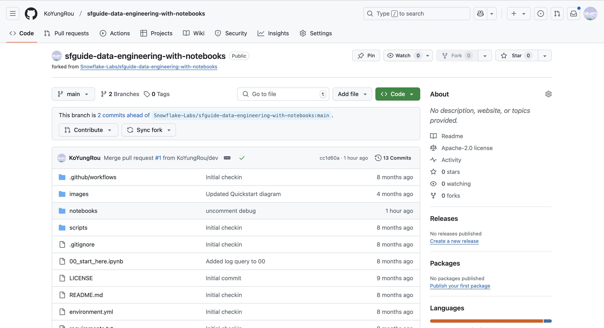

# Snowflake Data Engineering with Notebooks
This repository contains the code for the *Data Engineering with Notebooks* Snowflake Quickstart.

### ➡️ For overview, prerequisites, and to learn more, complete this end-to-end tutorial [Data Engineering with Notebooks](https://quickstarts.snowflake.com/guide/data_engineering_with_notebooks/index.html?index=..%2F..index#0) on quickstarts.snowflake.com.

___
Here is an overview of what we'll build in this tutorial:

## Overview
This lab demonstrates how to use **Snowflake Notebooks** for data engineering tasks, including data ingestion, transformation, and orchestration. The lab covers the following:

- Setting up Snowflake Notebooks
- Loading data into Snowflake
- Transforming data using SQL and Python
- Automating workflows with Tasks
- Visualizing data within the notebook

## Steps Completed
1. **Environment Setup**
   - Configured Snowflake Notebook environment
   - Created required databases, schemas, and warehouses
   

2. **Data Ingestion**
   - Loaded sample data into Snowflake tables
   - Explored data using SQL queries

3. **Deploy to Dev & Data Transformation**
   - Applied transformations & load location and order detail using SQL and Python
   - Used Snowpark for advanced data processing
   - Load Daily City Metrics

4. **Workflow Automation**
   - Created and scheduled Snowflake Tasks
   - Implemented dependency chaining for automation

5. **Data Visualization & Deploy**
   - Utilized built-in visualization tools
   - Analyzed transformed data with charts

6. **Push from Dev branch**

## Technologies Used
- Snowflake Notebooks
- Snowpark (Python)
- SQL
- Snowflake Tasks
- Data Visualization

## Conclusion
This lab provided hands-on experience in data engineering using Snowflake Notebooks, showcasing how to ingest, transform, automate, and visualize data efficiently.
